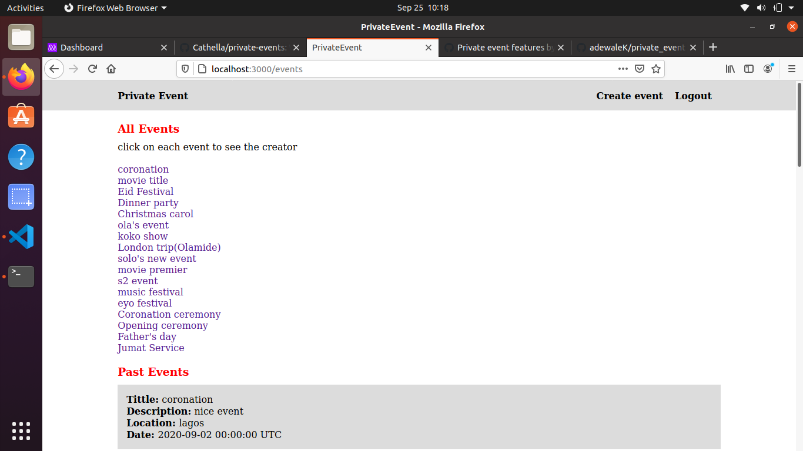
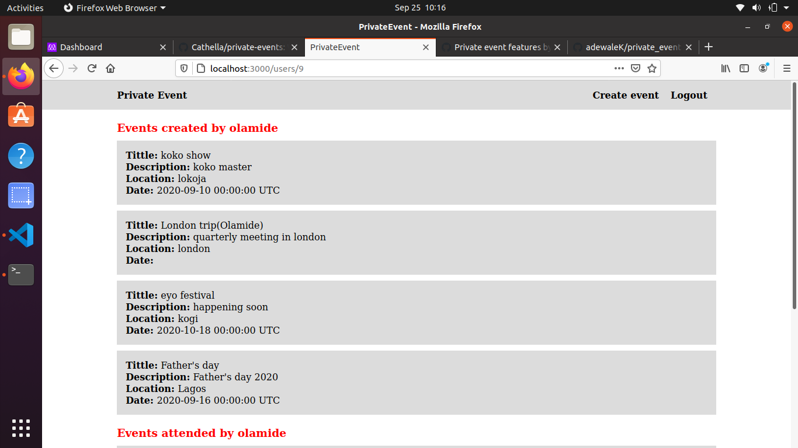
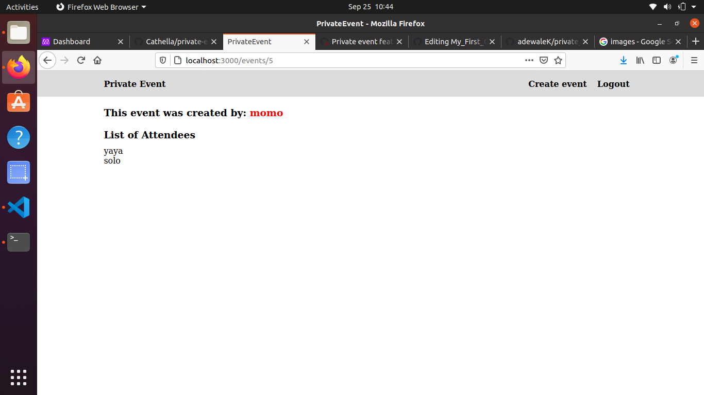

 

  <h3 align="center">Private Events</h3>
  
  
  

## Table of Contents

* [About the Project](#about-the-project)
* [Built With](#built-with)
* [Getting Started](#getting-started)
* [Contributing](#contributing)
* [Contact](#contact)

<!-- ABOUT THE PROJECT -->
## About The Project

This project involves building a site similar to a private Eventbrite which allows users to create events and then manage user signups. Users can create events and attend events. Events take place at a specific date and at a location. The project involves working with two models- the User and Event models are as described below.

`User Model
`
  
This User model is used to hold information of every single member of the site. The model stores users information in its username and email fields. Users can create and attend events. A user can create and attend many events.

`Event model
`
  
This model is used to hold information of every event. It stores information in title, description,location and date fields.

 
For more details about the Project and it's requirements go to <a href="https://www.theodinproject.com/courses/ruby-on-rails/lessons/associations"> The Odin Project</a>

## Home Page Showing List of All Past and Upcoming Events

## A Uer's Event Page Showing Their Past and Upcoming Events

## A Single Event Page Showing The Creator Name and List of Attendees

### Built With

* [RAILS]
* [VS-CODE]
* [Ruby]

<!-- GETTING STARTED -->
## Getting Started

1. Clone or fork the repo <https://github.com/adewaleK/private_event.git> to get a copy and explore the content of the Private-Events project.
2. Open the terminal, navigate to the cloned repository and run: bundle install
3. Run $ rails db:migrate
4. Run $ rails server or rails s
5. Load the project at localhost:3000 in a browser

<!-- RUNNING TEST -->
## How to Run Tests

The project is equipped with both unit tests for models validations and associations(Rspec) and integration tests for authentication and event management(Rspec + Capybara).
1. Open the terminal, navigate to the cloned repository and run: bundle install
2. Run $ rspec spec/models for all model tests
3. Run $ rspec spec/models/user_spec.rb for User(model) validations and associations
4. Run $ rspec spec/models/event_spec.rb for Event(model) validations and associations
5. Run $ rspec spec/models/user_spec.rb for Guest(model) validations and associations
6. Run $ rspec spec/feature for all integration tests
7. Run $ rspec spec/feature/login_spec for integration test on authentication
8. Run $ rspec spec/feature/event_spec for integration tests on event management

<!-- CONTRIBUTING -->
## Contributing

Contributions are what make the open source community such an amazing place to be learn, inspire, and create. Any contributions you make are **greatly appreciated**.

1. Fork the Project
2. Create your Feature Branch (`git checkout -b [Branch-name]`)
3. Commit your Changes (`git commit -m '[Commit-message]'`)
4. Push to the Branch (`git push origin [Branch-name]`)
5. Open a Pull Request

## Contact

Kamilu Adewale - [@KamiluAdewale](https://twitter.com/KamiluAdewale) - devkamilnaija@gmail.com
